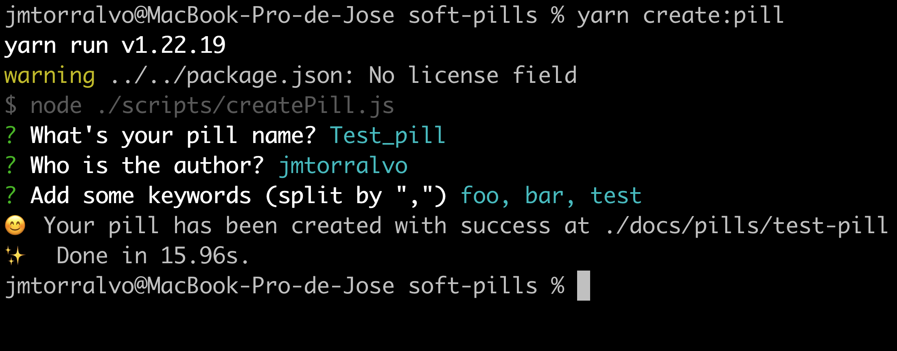
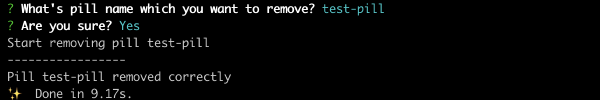

# How to add a pill:

If you want to **add** a pill, you have to follow these steps:

1. Download the repo [here](https://github.com/onebeyond/soft-pills)
2. Install dependencies using npm (there is a lockfile)
3. Launch the script `npm run create:pill`
4. Follow the instructions:

 
 

In case you want to **remove** any pill you can launch this other script
`npm run remove:pill`

And also follow the instructions:

