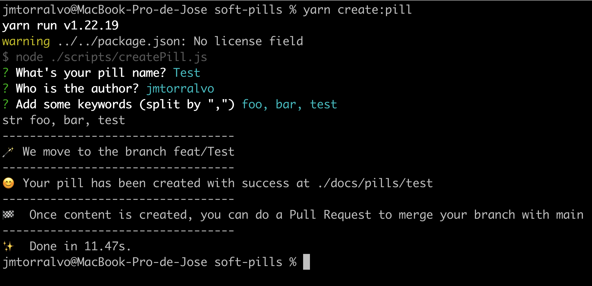

# How to add a pill:

If you want to **add** a pill, you have to follow these steps:

1. Download the repo [here](https://github.com/onebeyond/soft-pills)
2. Install dependencies using npm (there is a lockfile)
3. Be sure you are using **node 18**. If you use nvm you can run `nvm use`
4. Launch the script `npm run create:pill`
5. Follow the instructions:

6. Once the pill was done, please, create a pull request filling the template 😉

 
 

# How to remove a pill:

In case you want to **remove** any pill you can launch this other script
`npm run remove:pill`

And also follow the instructions:

 
 

* _Have in mind that the pills files are done using markdown language. [here](https://www.markdownguide.org/basic-syntax/) you can check a syntax guide that can help you_
